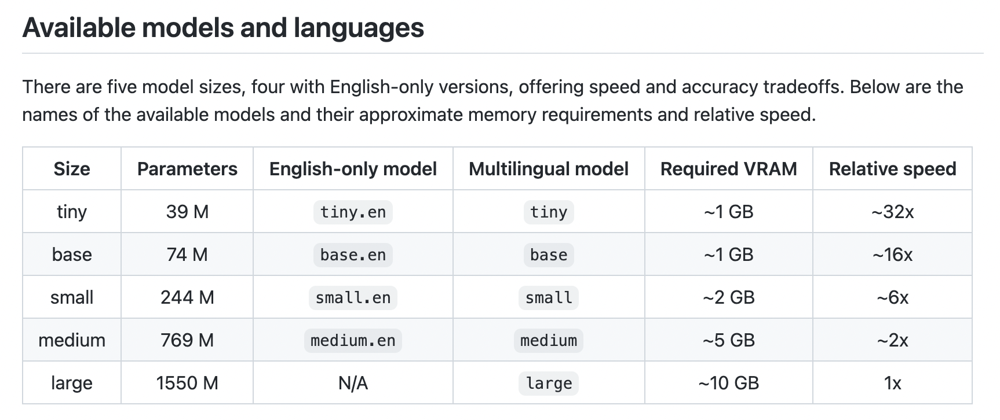
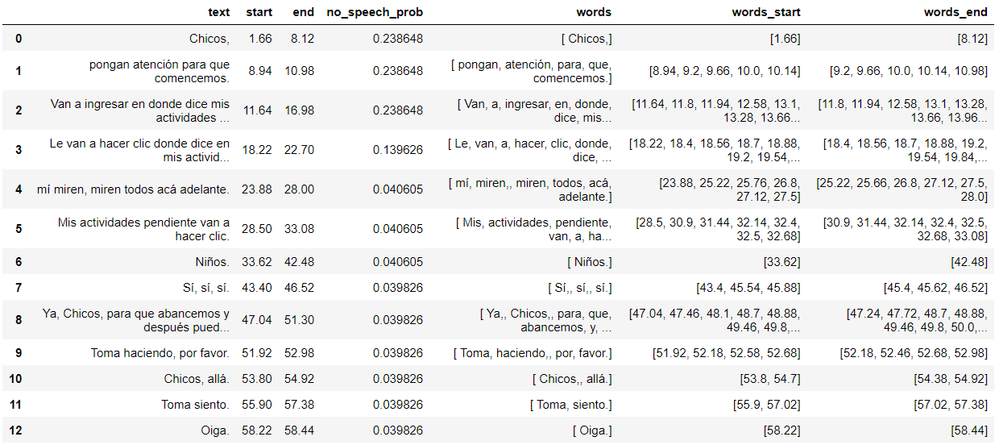

# Proyecto de transcripción de audio
Este proyecto consiste en un programa que permite transcribir audios y dar un output en un formato de dataframe determinado.

## Instalación
Para utilizar este programa, se utilizaron las siguientes librerías y sus versiones:

* Python 3.9.13
* ffmpeg 2022-06-16-git-5242ede48d-full_build
* Pandas 1.4.4
* stable-whisper 2.0.1
* openai-whisper 20230314

Estas versiones son solo referencias, es probable que funcione simplemente con las últimas versiones de cada librería.

Para instalar __Whisper__ 

```python
pip install -U openai-whisper
```
para la última versión
```python
pip install --upgrade --no-deps --force-reinstall git+https://github.com/openai/whisper.git
```
Más información en [La página de Whisper-OpenAI](https://github.com/openai/whisper#setup)

y para instalar __Stable Whisper__ 
```python
pip install -U stable-ts
```
para la última versión
```python
pip install -U git+https://github.com/jianfch/stable-ts.git
```
Más información en [La página de Stable Whisper](https://github.com/jianfch/stable-ts#setup)
## Uso
Sigue los siguientes pasos:

1. Importa los módulos necesarios de la carpeta Transcriptor del archivo Transcriptor.py:
  ```python
  from Transcriptor import *
  ````
2. A partir del archivo mp4 puedes crear el archivo wav con la función 
  ```python
create_wav("\video_path.mp4","\audio_path.wav")
  ```
2. Define la variable __'modelo'__ según alguno de los modelos de Whisper y carga el modelo con la función __run_model__
  <div style="text-align:center"></div>

  ```python
  modelo = "base"
  model = run_model(modelo)
  ````
3. Ejecuta la función __transcribir__ con los parámetros definidos anteriormente:

  ```python
  result_json, idx = transcribir(audio_path, model)
  ````
4. Finalmente con la función __json_to_dataframe__ crea el dataframe que resume la información del json:
  ```python
  dataframe = json_to_dataframe(result_json, idx) 
  ````
5. Guarda el dataframe
  ```python
  dataframe.to_csv(idx.csv)
  ````
#### Tests
En la carpeta audio_de_prueba está el archivo de audio que con modelo ="base" entregó el siguiente dataframe
  <div style="text-align:center"></div>
En la misma carpeta se encuentran archivos csv de algunos audios transcritos para ejemplificar el resultado.
